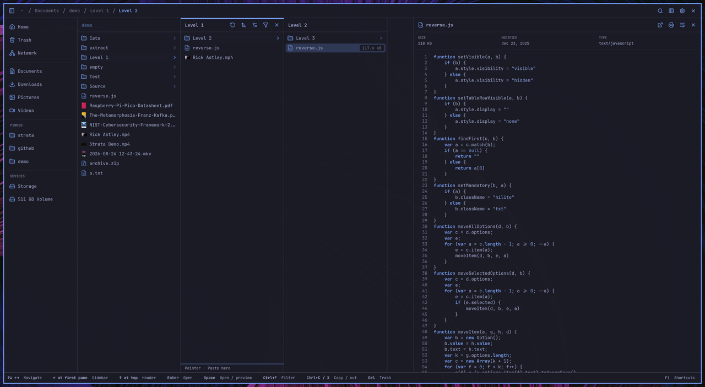
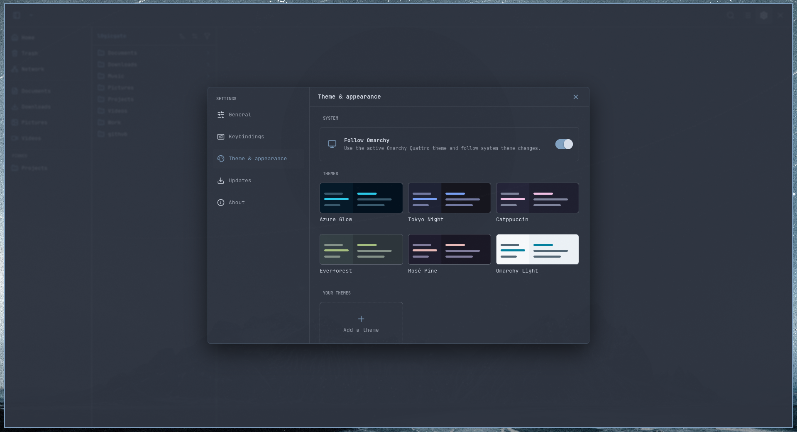

<div align="center">


# Strata

**Navigate every layer.** A fast, keyboard-first file manager for modern Linux desktops.

[](https://github.com/lgse/strata/actions/workflows/ci.yml)
[](https://github.com/lgse/strata/releases/latest)
[](LICENSE)
[](#technical-specifications)

<picture>
  <source media="(prefers-reduced-motion: no-preference)" srcset="docs/assets/strata-demo.gif">
  
</picture>

<sub>The animation respects reduced-motion preferences. View the [static preview](docs/assets/strata-columns.png).</sub>

</div>

Strata combines spatial Miller-column navigation with familiar Grid and Explorer views, instant fuzzy filename search, rich previews, and native Linux desktop integration. It is designed for Omarchy and works on compatible GTK4 Linux environments.

## Contents

- [Features](#features)
- [Installation](#installation)
  - [AI-assisted installation](#ai-assisted-installation)
  - [Manual installation](#manual-installation)
- [Usage and desktop integration](#usage-and-desktop-integration)
  - [Desktop entry](#desktop-entry)
  - [Make Strata the Omarchy file manager](#make-strata-the-omarchy-file-manager)
  - [Network shares](#network-shares)
- [Theming](#theming)
  - [Follow Omarchy Quattro](#follow-omarchy-quattro)
  - [Bundled themes](#bundled-themes)
  - [Custom themes](#custom-themes)
- [Release channels](#release-channels)
- [Under the hood](#under-the-hood)
- [Technical specifications](#technical-specifications)
- [Development and documentation](#development-and-documentation)
- [Contributors](#contributors)
- [License](#license)

## Features

- **Three browser modes:** navigable Miller columns, a thumbnail Grid, and a sortable Explorer table.
- **Keyboard-first control:** Vim-style movement, navigation history, location entry, pane filtering, fuzzy search, file operations, and quick previews.
- **Fast recursive search:** press <kbd>Ctrl</kbd>+<kbd>K</kbd> to find files and directories by name or path while the tree is still being indexed.
- **Rich previews and thumbnails:** native rendered Markdown and static HTML, plus bounded previews for text, source code, images, camera RAW, PDF, audio, and video, with native parser-backed formats isolated from the application.
- **Responsive filesystem work:** cancellable directory loading, bounded streaming, incremental monitoring, stable selection, and virtualized large directories.
- **Everyday file operations:** create folders, rename, cut, copy, paste, trash, permanent delete, sorting, hidden files, pins, and history.
- **Remote locations:** browse GIO/GVfs locations such as authenticated SMB shares from the location field.
- **Adaptive appearance:** compact or airy density, six bundled themes, custom themes, and live Omarchy Quattro theme following.
- **Updates in the app:** opt-in automatic checks, release notes, verified downloads, and in-place installation for release binaries.

## Installation

Strata currently publishes release archives rather than distribution packages. Arch Linux and Omarchy are the primary supported environments; current binaries require **glibc 2.39 or newer** and the runtime libraries listed below.

### AI-assisted installation

Give this prompt to a coding agent with terminal access:

```text
Install the latest stable Strata release from https://github.com/lgse/strata safely.

Before changing anything:
1. Confirm this is a glibc-based Linux system with a graphical GTK4 environment.
2. Detect whether the machine is x86_64 or aarch64 and select only the matching
   *-unknown-linux-gnu archive from the canonical lgse/strata GitHub release.
3. Show me the runtime packages you need and ask before using sudo or changing
   my default file-manager association.

Then:
- Install the required GTK4, GtkSourceView 5, Poppler GLib, Fontconfig, Bubblewrap,
  FFmpeg/GStreamer, and desktop-integration runtime dependencies using the system
  package manager. Add gvfs-smb only if I want SMB support.
- Download the archive and its matching .sha256 file from the latest GitHub release.
- Verify the checksum with sha256sum --check and verify GitHub Actions provenance
  with `gh attestation verify <archive> --repo lgse/strata`. Stop on any failure;
  never install an unverified binary.
- Extract it and install `strata` to ~/.local/bin/strata without overwriting an
  unrelated file. Ensure ~/.local/bin is on PATH.
- Ask whether I want a per-user desktop entry and inode/directory association;
  if yes, use application ID io.github.lgse.Strata and refresh the desktop database.
- Launch `strata`, report its installed version/source release, and verify the
  desktop association if one was requested. Do not weaken the preview sandbox.
```

### Manual installation

#### 1. Check the architecture and install dependencies

```bash
case "$(uname -m)" in
  x86_64)  target=x86_64-unknown-linux-gnu ;;
  aarch64) target=aarch64-unknown-linux-gnu ;;
  *) echo "Strata has no prebuilt release for $(uname -m)" >&2; exit 1 ;;
esac
printf 'Use the %s release archive.\n' "$target"
getconf GNU_LIBC_VERSION   # must report glibc 2.39 or newer
```

On Arch Linux or Omarchy:

```bash
sudo pacman -S --needed bubblewrap ffmpeg ffmpegthumbnailer fontconfig \
  gst-libav gst-plugins-good gtk4 gtksourceview5 poppler-glib
# Optional SMB support:
sudo pacman -S --needed gvfs-smb
```

GTK **4.12 or newer** and glibc **2.39 or newer** are required. Other glibc-based distributions may work when they provide equivalent runtime libraries, but their package names and binary compatibility vary. Systems with an older glibc must [build Strata from source](#development-and-documentation).

#### 2. Download and verify

From the [latest release](https://github.com/lgse/strata/releases/latest), download the `.tar.gz` matching `$target` and its identically named `.sha256` file. Then verify both its digest and signed GitHub Actions provenance:

```bash
cd ~/Downloads
archive="strata-<version>-${target}.tar.gz"
sha256sum --check "${archive}.sha256"
gh attestation verify "$archive" --repo lgse/strata
tar -xzf "$archive"
```

Both verification commands must succeed. Install the binary and confirm it starts:

```bash
install -Dm755 "${archive%.tar.gz}/strata" "$HOME/.local/bin/strata"
command -v strata
strata
```

If `command -v` fails, add `$HOME/.local/bin` to your shell's `PATH`. Every archive contains `SOURCE_COMMIT`, identifying the exact source revision used by GitHub Actions.

#### 3. Update or uninstall

Use **Settings → Updates** for verified in-app updates, or repeat the download, verification, and `install` steps for a newer release. To remove a per-user installation:

```bash
rm -f ~/.local/bin/strata \
  ~/.local/share/applications/io.github.lgse.Strata.desktop
update-desktop-database ~/.local/share/applications 2>/dev/null || true
```

User preferences and custom themes remain under the XDG configuration directories so an uninstall does not destroy personal settings.

## Usage and desktop integration

Launch Strata with an optional local directory:

```bash
strata                 # home directory
strata ~/Documents     # a specific directory
```

Useful shortcuts include <kbd>Ctrl</kbd>+<kbd>K</kbd> for recursive search, <kbd>Ctrl</kbd>+<kbd>L</kbd> for a path or URI, <kbd>Ctrl</kbd>+<kbd>F</kbd> to filter the current pane, <kbd>Space</kbd> for preview, <kbd>F2</kbd> to rename, and <kbd>Alt</kbd>+arrow keys for history and parent navigation.

### Desktop entry

Create a per-user launcher and optionally make Strata the default directory handler:

```bash
mkdir -p ~/.local/share/applications
cat > ~/.local/share/applications/io.github.lgse.Strata.desktop <<EOF
[Desktop Entry]
Name=Strata
Comment=Navigate every layer
Exec=$HOME/.local/bin/strata %U
Icon=system-file-manager
Terminal=false
Type=Application
Categories=Utility;FileManager;
MimeType=inode/directory;
StartupNotify=true
EOF
update-desktop-database ~/.local/share/applications
xdg-mime default io.github.lgse.Strata.desktop inode/directory
xdg-mime query default inode/directory
```

The final command should print `io.github.lgse.Strata.desktop`.

### Make Strata the Omarchy file manager

The XDG association above handles folders opened by applications. On current Lua-based Omarchy releases, also override the stock Nautilus shortcuts in `~/.config/hypr/bindings.lua` so Omarchy launches Strata directly.

First inspect the active bindings and back up your user configuration:

```bash
omarchy menu keybindings --print | grep -i "file manager"
cp ~/.config/hypr/bindings.lua ~/.config/hypr/bindings.lua.bak.$(date +%s)
```

Append these overrides to `~/.config/hypr/bindings.lua`:

```lua
-- Use Strata instead of Nautilus for Omarchy's file-manager shortcuts.
hl.unbind("SUPER + SHIFT + F")
hl.unbind("SUPER + ALT + SHIFT + F")
o.bind("SUPER + SHIFT + F", "File manager", { launch = "strata" })
o.bind("SUPER + ALT + SHIFT + F", "File manager (cwd)",
  "uwsm-app -- strata \"$(omarchy-cmd-terminal-cwd)\"")
```

The stock shortcut is <kbd>Super</kbd>+<kbd>Shift</kbd>+<kbd>F</kbd>, not <kbd>Ctrl</kbd>+<kbd>Shift</kbd>+<kbd>F</kbd>. To support the Ctrl chord too, first confirm that it is not assigned to another action, then optionally append:

```lua
o.bind("CTRL + SHIFT + F", "File manager", { launch = "strata" })
```

Apply and validate the configuration:

```bash
hyprctl reload
hyprctl configerrors
omarchy menu keybindings --print | grep -i "file manager"
```

`hyprctl configerrors` should produce no errors. These user overrides survive Omarchy updates; do not edit files under `/usr/share/omarchy/`.

### Network shares

Press <kbd>Ctrl</kbd>+<kbd>L</kbd>, enter an address such as `smb://server/share`, and press <kbd>Enter</kbd>. Strata uses GIO/GVfs and prompts for credentials when required. Install your distribution's SMB GVfs backend (`gvfs-smb` on Arch) to enable SMB browsing.

## Theming

Open **Settings → Theme & appearance** from the gear menu or with <kbd>Ctrl</kbd>+<kbd>,</kbd>. Theme changes apply immediately across the interface.



### Follow Omarchy Quattro

On **Omarchy Quattro**, turn on **Follow Omarchy** under **Settings → Theme & appearance**. Strata maps the active Omarchy palette to its semantic colors, monitors the current theme, and updates live whenever Omarchy's theme changes.

This integration supports Omarchy Quattro only. The switch is hidden when Strata cannot find a valid Quattro current-theme state; legacy Omarchy theme layouts are not supported.

### Bundled themes

Choose any included theme from **Settings → Theme & appearance**: Azure Glow, Tokyo Night, Catppuccin, Everforest, Rosé Pine, or Omarchy Light. Selecting a bundled theme turns off Omarchy following and keeps that theme active across restarts.

### Custom themes

Select **Add a theme**, enter a name, and choose the semantic colors for the background, surfaces, text, accent, danger, muted and highlighted elements, borders, and dimmed text. Strata previews edits live and saves completed themes under **Your themes**.

Custom themes are stored as shareable TOML files in `~/.config/strata/themes/`. See [Themes](docs/themes.md) for the schema, file location, and Omarchy color mapping.

## Release channels

Strata defaults to the **Stable** channel: only final tagged releases are ever offered, and a Stable install never receives, sees, or is notified about a prerelease.

To try upcoming changes early, choose a channel in **Settings → Updates**. **Preview** receives curated alpha, beta, and release-candidate builds but excludes nightlies. **Nightly** receives every recognised prerelease, including daily development builds. The update dialog and release notes always identify the exact build kind.

When a prerelease installation selects **Stable**, the Updates card immediately offers the newest stable release as the channel target—even when that requires a semantic downgrade—and labels the action **Return to stable**. Preview and Nightly selections use the same card for ordinary forward updates, so channel changes never create a separate competing rollback card.

See [Releasing](docs/releasing.md) for the tag grammar these channels rely on and, for maintainers, how a release candidate is cut and promoted.

## Under the hood

### Why search stays fast

Strata walks and indexes the selected directory tree on a background thread, never on GTK's UI thread. Results appear progressively during that walk. Names and relative paths are normalized once as index entries are created, and each query maintains only the best **100** fuzzy-ranked matches instead of sending an unbounded result set to the interface.

Rapid keystrokes are coalesced to the newest query. During indexing, result publication is throttled to 50 ms intervals; the UI consumes those bounded updates on its own timed loop, keeping rendering aligned with responsive frame-sized work. Exact and contiguous matches, word/path boundaries, and names rank ahead of loose path subsequences.

The deliberate tradeoff: this is fast **filename and path** search, not file-content or metadata search.

### How previews contain untrusted parsers

Files shown while browsing are untrusted. Image, camera RAW, PDF, thumbnail, and media parsing therefore runs out of process through **Bubblewrap**, not inside the main Strata process. Each short-lived helper receives namespace isolation, a minimal read-only runtime, exactly one canonicalized input file, private output and temporary directories, no network, and no capabilities. Memory, CPU/wall time, input, file, and parent-side output limits bound the work.

Only media helpers may receive allowlisted GPU render devices, and only for accelerated transcoding; image, PDF, and thumbnail helpers receive no device mounts. Outputs are normalized and bounded, then checked for expected PNG, MP4, or WebM signatures before use. Cancellation or timeout kills the process group and Bubblewrap PID namespace, tearing down descendants. Missing isolation, crashes, malformed output, timeouts, and permission failures all fail closed to a normal icon or **Preview unavailable**—Strata never silently retries an untrusted native parser without the sandbox.

Plain-text and source previews are different: they stay in process because they do not invoke a native format parser, and reads are capped at 1 MiB. See [Preview sandbox](docs/preview-sandbox.md) for provider ordering, exact mounts, formats, and resource budgets.

## Technical specifications

| Area | Details |
| --- | --- |
| Platform | 64-bit Linux with glibc 2.39+; designed for Omarchy and Wayland. GTK may use another backend supplied by the host, but Wayland is the primary display stack. |
| Release architectures | `x86_64-unknown-linux-gnu` and `aarch64-unknown-linux-gnu` |
| UI and runtime | Rust 2024, GTK 4.12+, GIO/GLib, Cairo, GtkSourceView 5, Poppler GLib, GDK Pixbuf, GStreamer, and Fontconfig |
| Filesystems | Native Linux paths (including non-UTF-8 names) and GIO/GVfs locations; remote protocol availability depends on installed GVfs backends |
| Preview boundary | Bubblewrap is mandatory for native parser-backed previews; helpers have no network and fail closed. Plain text is read in process with a 1 MiB cap. |
| Optional preview tools | `ffmpegthumbnailer`/`ffmpeg` for video; ImageMagick, classic `dcraw`, and LibRaw `simple_dcraw` expand camera RAW support |
| Hardware acceleration | Media-only VA-API or Vulkan attempts with software VP8/WebM fallback; GPU and codec support depend on host drivers/plugins |
| Scale targets | Virtualized browser models and bounded asynchronous updates are tested with deterministic directories up to 100,000 entries |
| Packaging | Dynamically linked release archive with SHA-256 digest, GitHub build-provenance attestation, and `SOURCE_COMMIT` |

## Development and documentation

Build requirements are the latest stable Rust toolchain, a C toolchain, `pkg-config`, GTK 4.12+, GtkSourceView 5, Poppler GLib, and Fontconfig. On Arch:

```bash
sudo pacman -S --needed base-devel rust bubblewrap ffmpeg ffmpegthumbnailer fontconfig \
  gst-libav gst-plugins-good gtk4 gtksourceview5 poppler-glib
make start-dev        # rebuild and restart as files change
./scripts/check.sh    # format, compile, Clippy, tests, and optional policy checks
```

Start with [CONTRIBUTING.md](CONTRIBUTING.md) before opening a pull request. Deeper references:

- [Architecture principles](docs/architecture.md)
- [Preview sandbox](docs/preview-sandbox.md)
- [Performance baseline](docs/performance-baseline.md)
- [Themes and Omarchy integration](docs/themes.md)
- [Unsafe code policy](docs/unsafe-code.md)
- [Releasing](docs/releasing.md)

## Contributors

<a href="https://github.com/lgse/strata/graphs/contributors">
  
</a>

This image is generated from GitHub contribution data so new contributors appear without a manual README update. Thank you to everyone who reports issues, improves the documentation, tests releases, and contributes code.

## License

Strata is free software licensed under **[GPL-3.0-or-later](LICENSE)**. Bundled fonts, icons, and other third-party components retain their own notices in [THIRD_PARTY_LICENSES.md](THIRD_PARTY_LICENSES.md).
