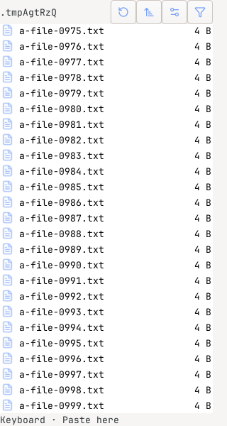
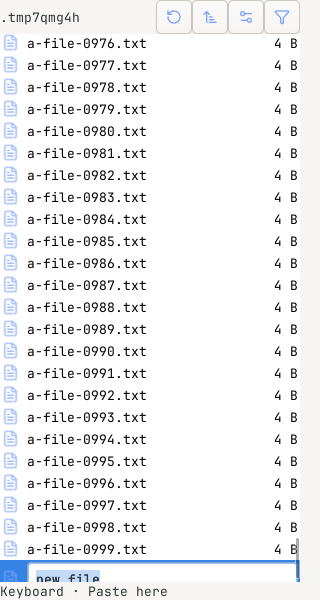

# New-entry allocation on GTK 4.14

These cropped screenshots come from the isolated GTK regression fixture, not the
application's themed window or a user's desktop. The fixture contains 1,000
synthetic files and 1,000 synthetic folders.

| Before | After |
| --- | --- |
|  |  |

GTK 4.14 had bound the new row at position 2000 without mapping or allocating it.
The preceding row was visible, but requiring the new row's allocation before
requesting its scroll left creation waiting for an editor that never appeared.
Requesting the reveal before that guard allows the existing creation tick to
finish. No deadline, assertion, or fixture size was changed.

This was exposed by requiring GTK execution in the shared quality environment.
See issues #613 and #634.
