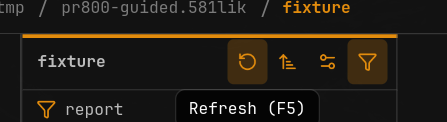
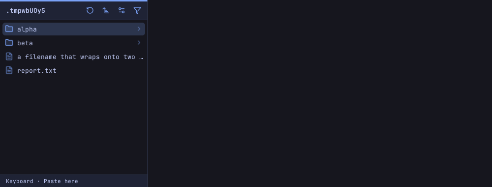
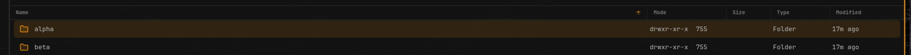
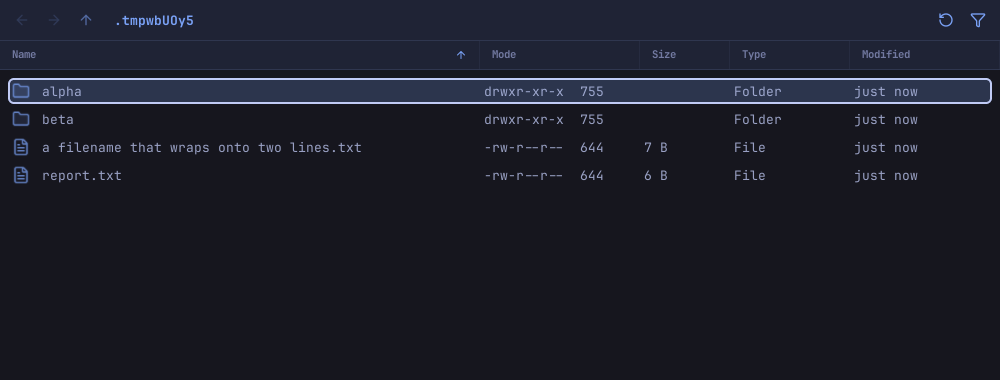
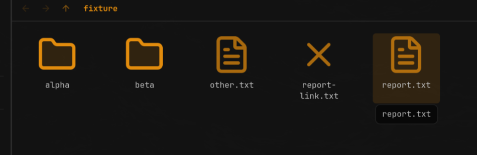
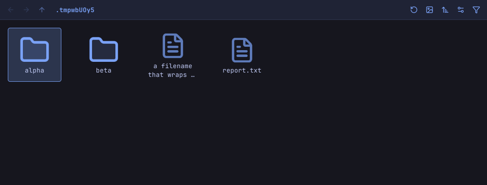
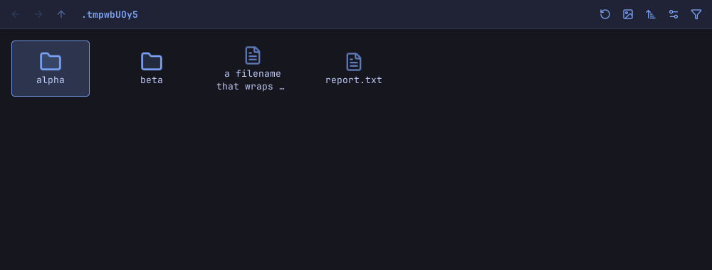

# Browser spacing and icon sizing (#804)

Before images were supplied by the owner. After images use synthetic files in a
private Xvfb/D-Bus session on the pinned GTK 4.14.5 environment. The themes and
viewport sizes differ; these are behavior/layout examples, not pixel-diff baselines.

## Pane controls

Buttons and folder names are vertically centered below the real three-pixel
accent border. Columns and List toolbars have the same overall height. Columns
row side gaps match the top gap.

| Before | After |
| --- | --- |
|  |  |

## List view

The first row has the same eight-pixel gap above it as on either side. Its icon
slot aligns with the Name heading; row selection and column resizing remain intact.
Columns and List rows both measure 26px in Compact and 42px in Airy. The List
inset belongs to the scroller, keeping renamed entries inside its visible area.

## Icons view

File glyphs are height-limited to the folder glyph without stretching their aspect
ratio. Photo thumbnails keep their existing sizing. Labels retain usable width
and two lines at the new 32px minimum. The icon and visible caption are centered
together, including wrapped names. All four outer Icons insets are reduced by
3px in both densities.

| Before | After |
| --- | --- |
|  |  |

## First-entry hover and diagnostics

The initial selection remains selected, but now visibly responds to pointer hover
in all three modes, with or without listing focus. Keyboard navigation still
suppresses hover from a parked pointer. Exercise this immediately after startup
and after opening a folder with the keyboard, without clicking first.

Unsupported CSS `!important` declarations have been removed; the complete
stylesheet is checked for parser errors.

To regenerate after images, create `target/ui-evidence` and run
`./scripts/test-headless.py browser_chrome_insets`. This requires the private
headless test dependencies; never use the desktop display or session bus.
