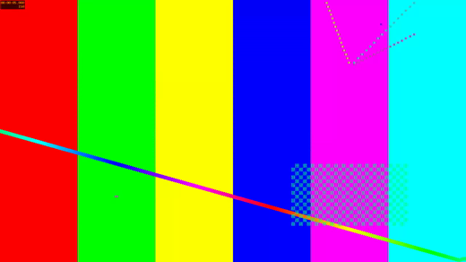

# FFmpeg quick-preview performance (#822)

Synthetic H.264/AAC input, generated with FFmpeg `testsrc2` (30 fps, 30 seconds)
and a sine-wave audio track. No private videos or desktop sessions were used.

## Frame comparison

These are normalized video-frame captures at five seconds, displayed at the same
520×292 size, not screenshots of the surrounding application UI:

| Before: VP8, 1280-pixel edge | After: software H.264, 520×800 pane budget |
| --- | --- |
|  |  |

The comparison checks visible detail at the intended display size. It does not
establish equivalent quality for all footage, HDR, or every codec/profile.

## Processing measurements

Median of three runs on the same Arch Linux host, FFmpeg 9.0.1. All input decoding
and encoding used bubblewrap with the application's filesystem/device policy;
the new measurements invoke the built Strata preview helper with `520x800`.
Times cover complete clip production, not GUI time-to-first-frame.

| Source / backend | Before | After |
| --- | ---: | ---: |
| 640×360, software | 2.70 s | 0.32 s |
| 1920×1080, software | 3.30 s | 0.62 s |
| 1920×1080, successful Automatic hardware path (AMD VA-API) | 3.42 s | 2.03 s |
| 1920×1080, Vulkan | 1.18 s | 1.07 s |

The old software path used VP8 at 1280×720, even for the smaller source. The new
software path uses ultrafast H.264 and fits the pane without enlarging the source.
Automatic still tries VA-API before Vulkan, so backend selection remains a
separate opportunity. The earlier hardware measurements time the successful
backend; the new helper timing also includes Automatic's failed NVIDIA VA-API
probe. Hardware timings depend strongly on the installed drivers.

Playback still waits for the complete normalized clip. The first-30-seconds cap
is retained: the regression fixtures include a generated one-hour source and
check both software encoders produce only 30 seconds. Other fixtures verify
landscape/portrait sizing, no upscaling, 60-to-30-fps limiting, audio preservation,
and actual GTK playback. The pinned test image now contains FFmpeg and the media
plugins needed to run those checks without skips.

The GTK 4.14 regression exposed its unsupported input-stream playback path.
Normalized clips are therefore prepared off-thread in private temporary files,
shared by the cache and active players, and removed after their final owner drops.
No original media is passed to GTK. The separate Ubuntu sandbox library-alias
problem (#806), progressive playback, and backend-selection changes remain out
of scope.
