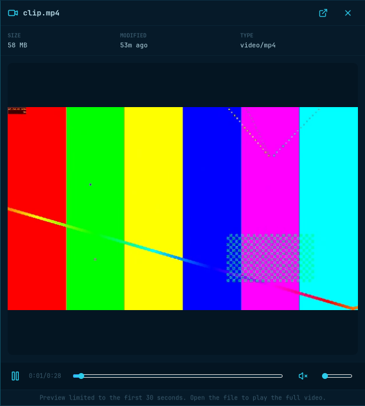
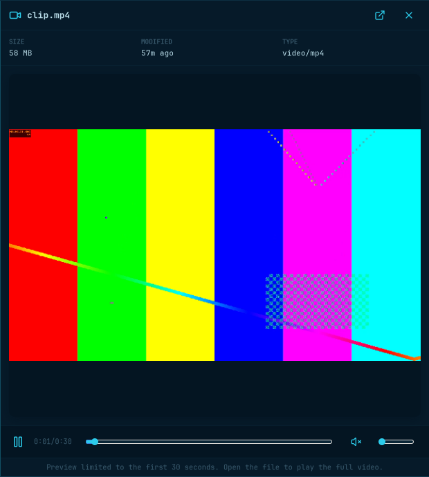

# #824: incremental sandboxed media

Implements [#824](https://github.com/lgse/strata/issues/824), after
[#823](https://github.com/lgse/strata/pull/823). See
[the architecture, protocol and budgets](../../preview-sandbox.md).

## Visible startup

[Before/after startup recording](startup-comparison.mp4) — generated 30-second
1080p H.264/AAC, Software backend, private Xvfb/D-Bus, no desktop capture or real
audio output. The crop excludes host paths/devices. No UI redesign is intended.

| Before: #823 | After: decoded frames |
| --- | --- |
|  |  |

At 20 capture frames/second, the first changing video image appeared **3.30 s**
after the pane appeared before, versus **1.05 s** after (50-ms resolution).
The playback label reached one second **4.286 s** after the opening keypress
before, versus **1.993 s** after. These are different endpoints: neither the
one-second label nor the helper measurements below is a first-frame timestamp.
[Recording frame indices](recording-timings.json) record pane appearance, first
colored image, and its first subsequent change. Detection used the fixed header
and central video regions of these generated test-pattern recordings.

The new debug trace reported its first texture submission at 968 ms; warm
reopens were around 180 ms. Decoding continues behind bounded pipes while GTK
presents frames. The video process outputs `rawvideo`, the audio process
`pcm_s16le`; neither compresses a new playable clip. GTK never opens a media URI.

## Generated-fixture measurements

Measured on an AMD Ryzen 9 9950X3D (32 logical CPUs), glibc 2.44, FFmpeg 9.0.1,
GTK 4.22.4 and GStreamer 1.28.6. Both application executables were built in the
pinned Rust 1.98.1 container, without debug symbols, then run against those native
libraries. The baseline worktree was exactly `efe64e9` (#823). All runs used
Software and a 520 × 800 decode rectangle.

Values are **cold-input hint / median of three warm runs**, in milliseconds.
“Cold” means `POSIX_FADV_DONTNEED` on the fixture, not a machine reboot, cleared
shared-library cache, or a guarantee that the kernel discarded every page.

| Generated fixture | #823: complete normalized clip available | New: first distinct decoded frame available |
| --- | ---: | ---: |
| 3 s, 640 × 360, 30 fps, A/V | 80.9 / 80.5 | 83.2 / 81.4 |
| 30 s, 1920 × 1080, 30 fps, A/V | 726.0 / 683.9 | 86.9 / 87.4 |
| 30 s, 1080 × 1920, 30 fps, A/V | 746.2 / 725.6 | 91.1 / 88.9 |
| 10 s, 3840 × 2160, 30 fps, A/V | 825.0 / 864.4 | 106.0 / 105.3 |
| 30 s, 1280 × 720, 60 → 5 fps VFR, A/V | 505.0 / 483.5 | 84.5 / 83.5 |
| 1 hour, 64 × 48, 1 fps, video only | 61.2 / 59.4 | 58.3 / 58.0 |

These are **transport-readiness endpoints**, excluding GTK initialization and
presentation. The legacy player cannot open its normalized clip before complete
conversion; the new measurement stops at the first pair of distinct frames,
without reading the rest of the generation. Small/cheap files need not improve.
The hourly fixture is intentionally small; it exercises the duration limit,
not high-resolution throughput. Media inputs have no file-size cap.

| Seek target | #823: cached normalized-file seek acknowledgement | New: restarted decoder's first frame available |
| --- | ---: | ---: |
| Short, 1.5 s | 15.4 / 5.1 | 84.2 / 83.3 |
| Landscape, 15 s | 17.4 / 16.5 | 104.5 / 105.4 |
| Portrait, 15 s | 32.3 / 22.6 | 110.8 / 106.2 |
| High-resolution, 5 s | 22.5 / 12.7 | 182.3 / 172.2 |
| VFR, 15 s | 26.6 / 16.5 | 84.5 / 83.6 |
| Hour, 15 s | 2.9 / 1.7 | 77.2 / 58.1 |

The legacy seek measurement uses `GtkMediaFile` **only on the benchmark's
already-normalized generated clip**, in a separate isolated process per fixture.
The first seek has a file-cache discard hint; subsequent seeks reuse that player
and alternate by one tick. Its acknowledgement is not a measured screen redraw.
The new endpoint includes sandbox startup and original-file decoder preroll.

This tradeoff is real: cached seeks/reopens were cheaper before. In the production
widget on the native 1080p recording fixture, three paused Right-arrow seeks took
40/40/40 ms before (the keyboard harness's 40-ms floor), versus 292/594/393 ms
after. That fixture uses FFmpeg's default, longer GOP; the matrix explicitly uses
60-frame GOPs. Seek cost depends on codec, keyframe spacing, hardware and I/O.

Reproduce the matrix with two separately built executables:

```sh
python3 docs/evidence/824/benchmark.py --before /path/to/823/strata --after /path/to/824/strata
python3 docs/evidence/824/cached_seek.py
```

The first script generates its own inputs and puts both versions behind the same
Software bubblewrap boundary. The second also needs Python GTK introspection and
the legacy GTK/GStreamer playback backend/plugins. Neither script changes the
sandbox mounts to work around an unsupported installation. Raw measurements:
[startup/new seek](timings.json), [legacy cached seek](legacy-seeks.json).

## Ownership and resource evidence

An isolated native run paused an A/V preview, sought, waited 31 seconds, resumed
at the retained position, then closed/reopened it 20 times:

- Paused before release: 33 application FDs, 106 threads, two FFmpeg processes.
- After 31 seconds: 24 FDs, 74 threads, no media sandbox/FFmpeg processes. The
  frame/position remained; resume decoded from that position, not zero.
- Every subsequent close left no media sandbox/FFmpeg processes. Closed-cycle
  FDs stayed at 24 and threads at 106 during rapid reuse; idle toolkit worker
  threads settle later.

The first run's application RSS rose from about 205 to 271 MiB. A 100-cycle debug
run tracked **every pixel-buffer owner handed to GTK**, not just the latest
texture: outstanding texture bytes returned to **zero after every close**.
Application RSS was approximately 214/260/268/307 MiB at cycles 5/20/50/100.
Most growth was in arena-like anonymous mappings, not the main heap. A separate
40-cycle diagnostic with `MALLOC_ARENA_MAX=2` instead measured about 202/195/190 MiB
at cycles 5/20/40, settling at 190 MiB. This supports allocator retention rather
than a live preview-buffer leak. **No allocator override is shipped or required.**
RSS is not a live-buffer count, and these results do not establish a universal
RSS or VRAM plateau. [Resource samples](resources.json) include 789 GTK-side pixel
owners allocated/released and 101 returns to zero (initial preview + 100 cycles).
The historical nonzero `media_helpers` values included bubblewrap supervision,
not just helpers; the committed runner corrects that counter.

With the executables at `target/824-evidence/{before,after}-app/strata`, the
[private native runner](native_smoke.py) reproduces capture and resource checks:

```sh
python3 docs/evidence/824/native_smoke.py before
python3 docs/evidence/824/native_smoke.py after
python3 docs/evidence/824/native_smoke.py after --cycles 100
python3 docs/evidence/824/native_smoke.py after --cycles 40 --two-arenas
```

The last command is a child-only allocator diagnostic, not a recommended runtime
setting. Results/logs stay in `target/824-evidence/`. See the
[validation handoff](validation.md) for full checks and intentionally unverified
platforms/behavior.

The upstream `GtkMediaFile` cleanup problem (two FDs/two threads per instance on
affected GTK versions) is a separate baseline caveat. This player instantiates
neither `GtkMediaFile`/`GtkGstSink` nor `GstPlay`; it does not apply, retire or claim
to ship the opt-in [private runtime patches](../../../packaging/media-runtime/README.md).

Debug builds expose ownership traces with
`RUST_LOG=strata=debug,strata::ui::media::diagnostics=trace`. “Texture bytes
released” means the last GTK-side bytes owner actually dropped, not merely that
the preview discarded its reference. Worker start/stop logs report session slots;
a slot may outlive a finished reader while its last frames are presented.

## Manual reviewer checks

Use a disposable fixture folder and the **candidate executable**, not an old
Strata instance receiving the launch over D-Bus. Agents must use private
Xvfb/D-Bus as in [the testing guide](../../e2e-testing.md); ordinary reviewers can
exercise their own UI/audio deliberately. The native evidence used private buses,
a Cairo/software renderer, isolated HOME and disabled real audio-sink ranks.

Suggested generated inputs (no personal media required):

```sh
mkdir -p /tmp/strata-824-review
ffmpeg -nostdin -v error -f lavfi -i 'testsrc2=size=1920x1080:rate=30:duration=35' \
  -f lavfi -i 'aevalsrc=if(lt(mod(t\,1)\,0.04)\,0.15*sin(2*PI*880*t)\,0):s=48000:d=35' \
  -vf "drawbox=x=0:y=0:w=iw:h=ih:color=white:t=fill:enable='lt(mod(t,1),0.04)'" \
  -c:v libx264 -preset ultrafast -threads 2 -g 60 -c:a aac /tmp/strata-824-review/sync.mp4
ffmpeg -nostdin -v error -f lavfi -i 'testsrc2=size=320x180:rate=10:duration=2' \
  -threads 1 /tmp/strata-824-review/loop.gif
ffmpeg -nostdin -v error -f lavfi -i 'sine=frequency=660:duration=35' \
  -c:a flac /tmp/strata-824-review/audio.flac
```

1. **Architecture/startup:** choose Software in Settings → General's video preview
   backend controls. Open `sync.mp4` with Space. Expect moving video while the
   sandbox is still decoding, no new normalized MP4/WebM cache, and playback
   limited to the original first 30 seconds. Inspect only this application's
   descendants: `ps -C strata -o pid,ppid,args` identifies the
   `--preview-helper preview-media` process; `ps -C ffmpeg -o pid,ppid,args` shows
   separate `rawvideo` and `pcm_s16le` commands, not H.264/VP8 encoders. Do not
   count or kill unrelated FFmpeg jobs. The existing thumbnail helper is separate.
2. **Playback/audio:** pause/play, seek with Left/Right and the slider, and resize
   the pane while playing and paused. Expect correct position, pause state,
   aspect ratio and bounded frame size; resizing should not reconvert a clip.
   At a low volume, unmute with M: each flash should coincide with its beep.
   Seek near 29 seconds and ensure it stops at 30, not 30 seconds after the seek.
   Repeat with audio-only, album art, portrait, VFR and an hour-long fixture.
3. **Live settings/views:** open two browser windows and a file chooser, preview
   A/V, and change mute/volume in either window and Settings. Both browser players
   should update immediately without opening Settings first; rebuilt views and
   newly opened players retain saved values. Check scale factor 2/a HiDPI display
   and switch backend for the next preview. Hardware failure before output may
   fall back to software, never to an unsandboxed original-file player.
4. **Four-session cap:** use `loop.gif` in four windows of the **same application
   process**; looping avoids clips ending during setup. Open a fifth. Expect a
   busy explanation, with the four existing animations uninterrupted. Four
   sessions does not mean four PIDs: an A/V session has two FFmpeg children plus
   its helper/bubblewrap supervision. A separate portal process has its own cap.
5. **Idle release:** pause one of those four GIFs for more than 30 seconds. Its
   displayed frame must remain while its worker disappears. Close/reopen the
   fifth preview: it can now start. Close it before resuming the original so a
   slot is available; resume should retain position. A busy request is not queued
   indefinitely and does not preempt another player.
6. **Cancellation:** switch selection, close the pane, close a window during
   startup/seek, and repeat opening/closing at least 20 times. Expect obsolete
   helpers to exit, no accumulating FDs/threads/buffers after warm-up, and no late
   provider result reopening a destroyed window. Test both browser and chooser.
   Undecodable input and malformed/truncated helper output must fail closed, not
   trigger a native fallback. FFmpeg may salvage valid frames from damaged input.

**Compatibility:** GStreamer core/app/base libraries are now startup dependencies;
minimal self-updating installations must install them first. The installer and
AUR metadata are updated. By explicit owner decision, the Ubuntu runtime-library
alias issue [#806](https://github.com/lgse/strata/issues/806) is **not fixed here**.
An affected sandbox cannot exercise this path; do not report that as a successful
playback check. Native audible output, hardware acceleration and ARM64 were not
validated in these software/fakesink experiments.
