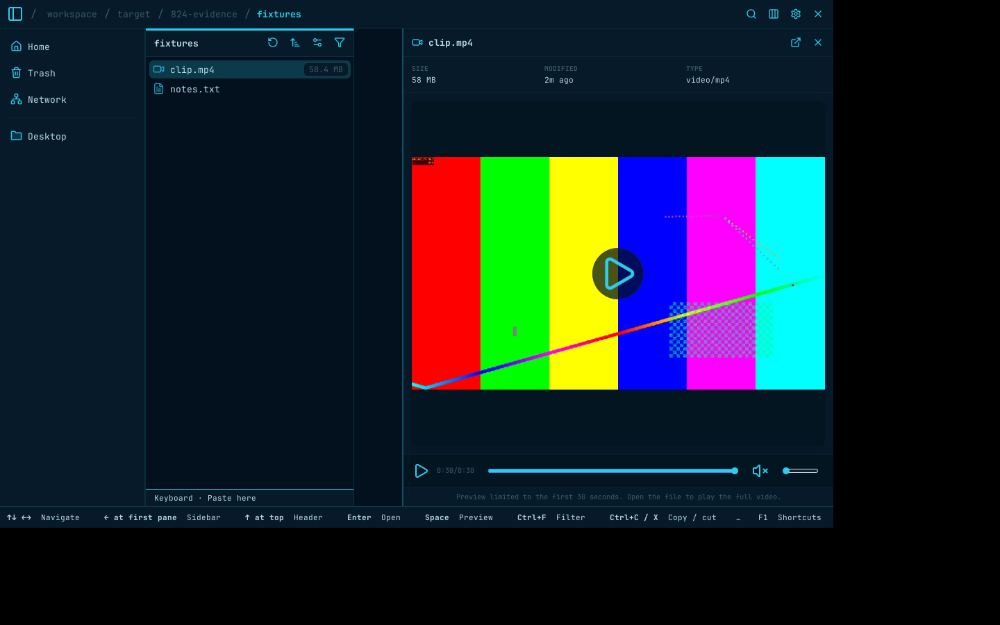

# PR #839 merge-preparation review

Merged verified `lgse/strata` main commit
`964d262ca5e1fe52c879a7a1287de6feff8b73d2` without conflicts.

## Corrections

- Full-length audio reached the sample budget and stopped consuming packets,
  including the end record. Playback then failed with a stalled-clock error.
  Queue capacity now remains available for that record; `push` still rejects
  samples beyond 30 seconds. The new full-interval GTK regression reproduced
  the failure before the fix and passes afterward, including resource release.
- Corrected the claimed media input-file size cap: unlike raster inputs, media
  inputs have no such cap. Output budgets and progress deadlines remain bounded.
- Audited added comments/doc comments, removed the redundant PCM type summary,
  and tightened benchmark module documentation to its parsing constraints.
  Retained legal notices, sandbox ownership constraints, descendant teardown,
  seek preroll, sample rounding and sink-clock rationale.

## Local validation

All commands ran from the temporary issue-specific review worktree. Podman used
an isolated task-owned store. The published image was unavailable (`manifest
unknown`), so `STRATA_CONTAINER_ENGINE=podman python3 scripts/e2e_base.py build`
bootstrapped it once. Subsequent canonical runs reused verified image
`11317f1184ca901f5cdc7fb99caa78f2d7ba6c330173b74525f95eb4006eced1`.

- `STRATA_CONTAINER_ENGINE=podman ./scripts/quality.sh test`:
  **1,480 passed, 18 ignored, 0 failed**, 370.82 seconds.
- `STRATA_CONTAINER_ENGINE=podman ./scripts/quality.sh fmt`: passed.
- `STRATA_CONTAINER_ENGINE=podman ./scripts/quality.sh clippy`: passed.
- `STRATA_CONTAINER_ENGINE=podman ./scripts/e2e.sh`:
  **788 passed**, 172.14 seconds.
- `PYTHONPATH=scripts python3 -m unittest test_installer test_update_aur test_e2e_packages`:
  **59 passed**.
- Python evidence scripts parsed; local Markdown file links and the complete
  final diff, including added comments, checked; `git diff --check` passed.

The quality phases execute `cargo fmt --all --check`,
`cargo clippy --locked --all-targets --all-features -- -D warnings`, and
`cargo test --locked --all-targets --all-features`. GTK runs used private
Xvfb/D-Bus and required GTK execution; E2E used private accessibility buses.

## Real-media diagnostic and screenshot

The unmodified pinned Ubuntu container reproduced the known #806 startup
failure, before playback. No application workaround or new sandbox mount was
added. A separate disposable container replaced only its BLAS/LAPACK
alternatives symlinks with copies of their resolved libraries. This diagnostic
is **not** proof that #806 is fixed or a replacement for canonical tests above.

Using the candidate executable, generated H.264/AAC media, software decoding,
private Xvfb/D-Bus/HOME and disabled real audio-sink ranks, the diagnostic:

- played the full interval, retained `0:30/0:30` beyond the eight-second error
  deadline, and replayed successfully;
- exercised three paused keyboard seeks, 31-second idle release and resume;
- closed/reopened 20 times, with no media-helper/FFmpeg descendants after close.

The screenshot is from that alias-adjusted diagnostic, nine seconds after
reaching the end. No desktop or personal media was captured. Audible output,
GPU decoding, ARM64 and installed upgrade/rollback remain unverified. The private
runtime patch kit and #806 remain unchanged.
