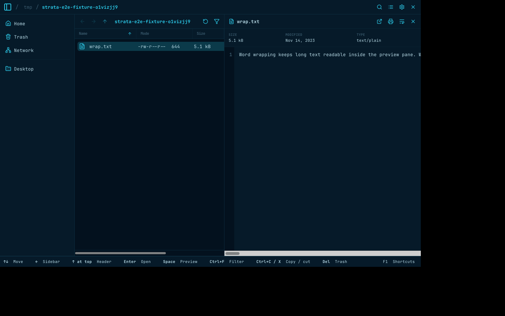
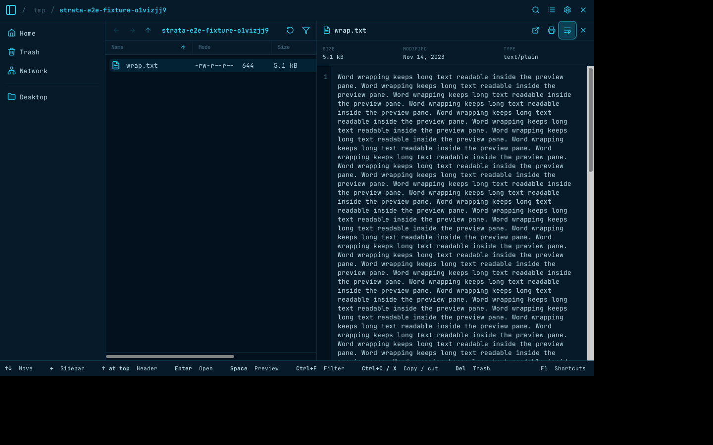

# Preview word wrap

Captured from PR #921 after merging main `a9587903ec6f95611e1bd7157c43031468aa2af1`, using the pinned E2E environment with private Xvfb and D-Bus. A long text fixture was opened with Space and the header wrap toggle clicked.

| Wrap off | Wrap on |
| --- | --- |
|  |  |

The wrapped text fits the preview pane, and the selected toggle uses the active theme color. The Rust preference regression covers saved startup, live synchronization across two drawers, both toggle directions, and replacement text previews.
