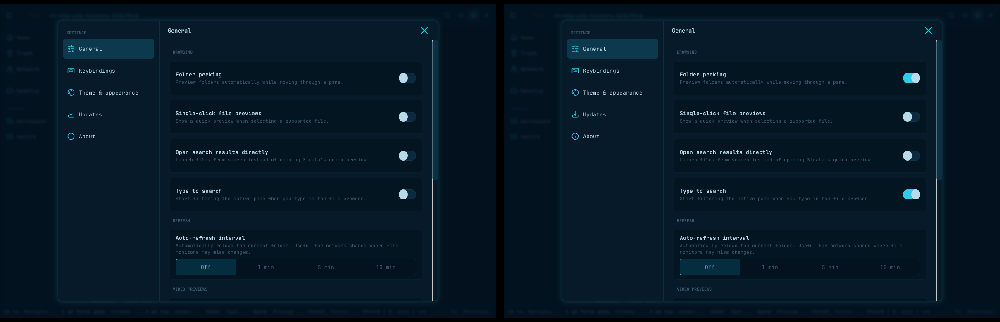
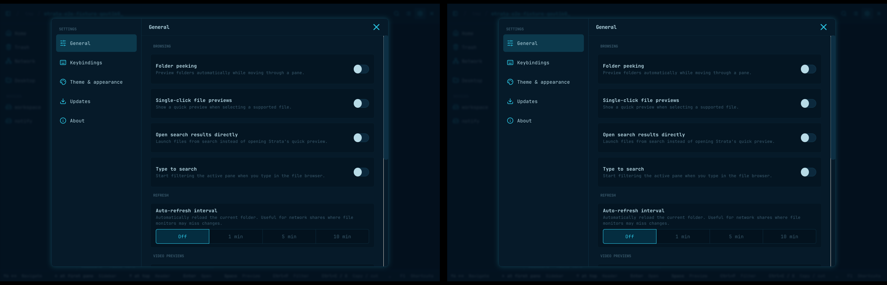

# Shared preferences (#212 / #515)

Both captures use two windows of the same process, disposable fixture files and
preferences, GTK 4.14.5 in the pinned E2E container, and a private Xvfb display.
Folder peeking and Type to search started enabled. Both were disabled in the
left window, without interacting with the right window's controls.

- **Before** (`9713eb1`): the right window keeps both switches enabled.
- **After**: both windows immediately show the saved disabled values.

