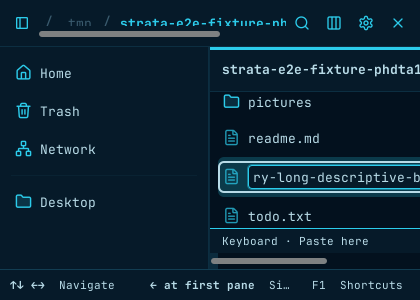

# Long-name rename caret (#394 / PR #591)

Captured on the canonical E2E image (GTK 4.14.5), using synthetic files,
a private Xvfb display, and real F2 → End input. Images are cropped to the
application window without altering the rendered contents.

| Columns before viewport constraint | Columns after viewport constraint |
| --- | --- |
|  |  |

Columns uses a 420×300 window with the sidebar open. The before frame comes
from the `rename-caret` mutation, which disables the viewport constraint; its
real-input scenario fails the editor-width assertion. The after frame is saved
by the passing scenario with `--keep-artifacts`.

List and Icons retain their existing scrolling behavior. Their 640×300 windows
leave room for minimum table/card widths while the filename still overflows
the editor:

- [List after End](list-after-end.png)
- [Icons after End](icons-after-end.png)
