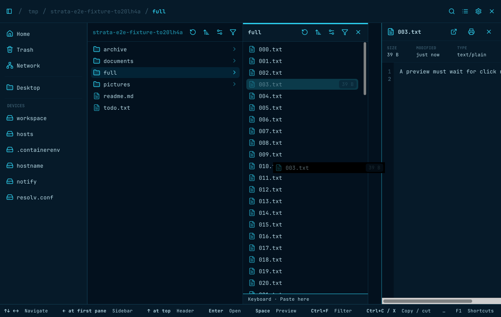
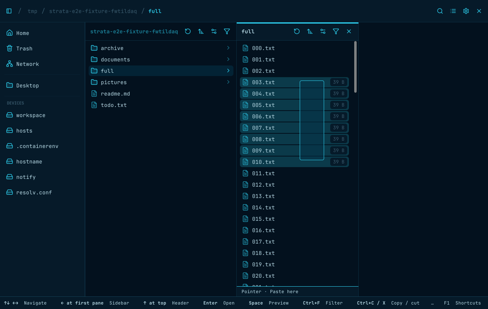
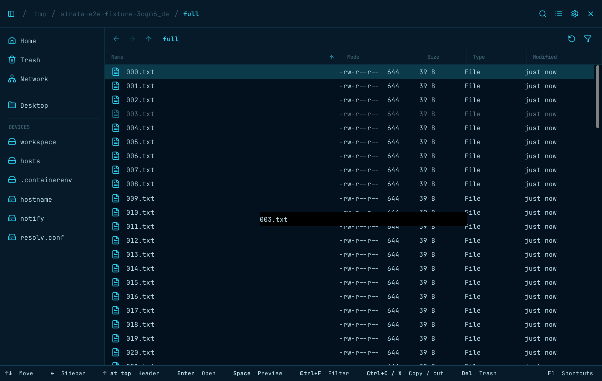
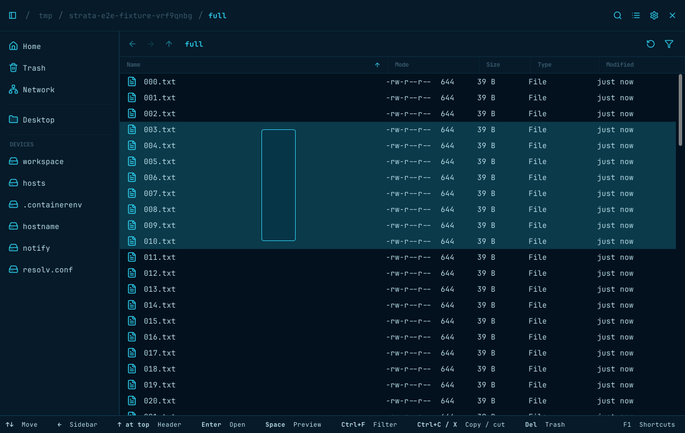
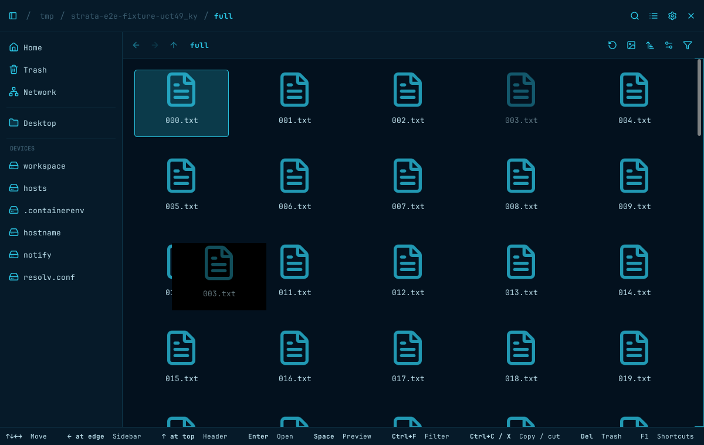
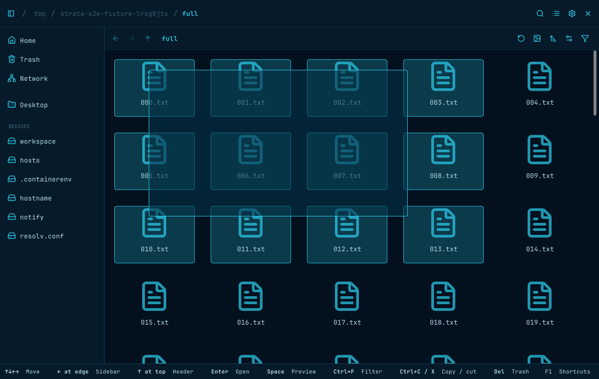
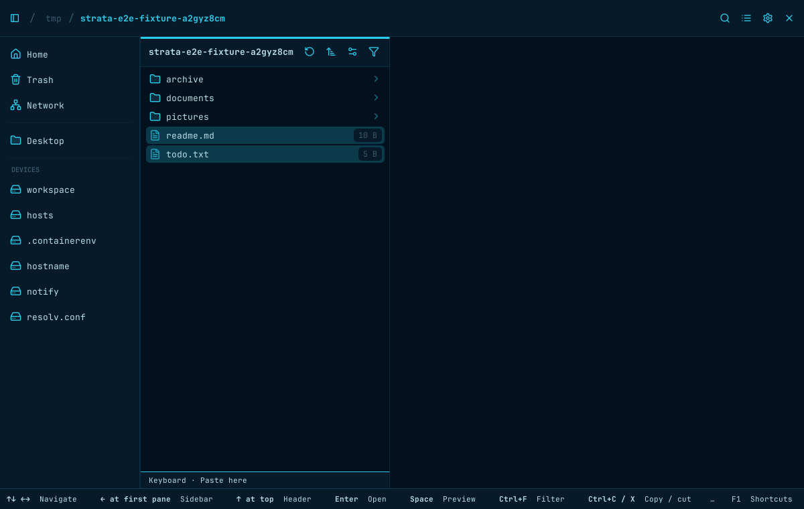
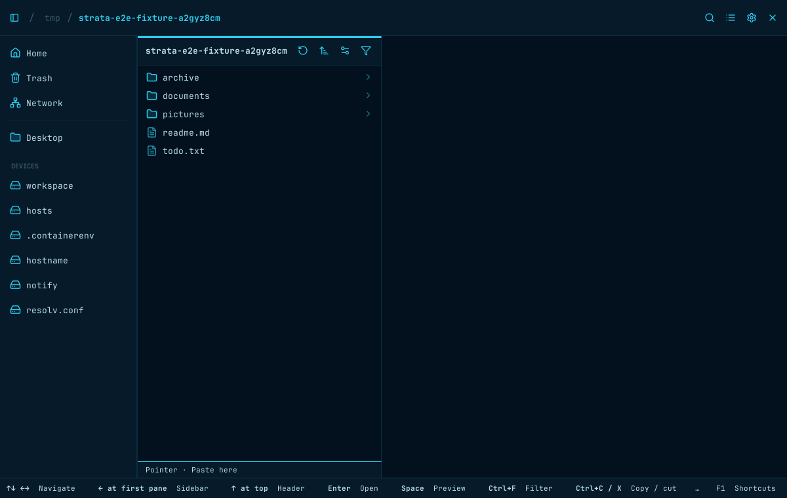

# Pointer drag intent (#517)

Captured on the private Xvfb display in the pinned GTK 4.14 E2E image.
Before: `96ec5b5`. After: `d27a7ad`. Images are cropped to the application window.

Each view shows a directory containing 100 text files, with single-click previews
enabled. The pointer is held after dragging from inert space beside `003.txt`
toward `010.txt`: trailing filename allocation in Columns/List, or the gutter
inside an Icons card beside its thumbnail.

Before, this starts an item drag; Columns also opens a preview prematurely.
After, it draws a marquee and selects the intersected entries without preview.
Dragging from the actual icon/name remains an item drag in every view.

| View | Before | After |
| --- | --- | --- |
| Columns (Grid) |  |  |
| List |  |  |
| Icons |  |  |

## Empty-background click follow-up

On the updated build, a completed plain click on empty space clears file
selections. This also works in List and Icons, in an empty column, and beside the
last column. Holding the press or extending a marquee preserves drag selection.

| Before the click | After the click |
| --- | --- |
|  |  |
