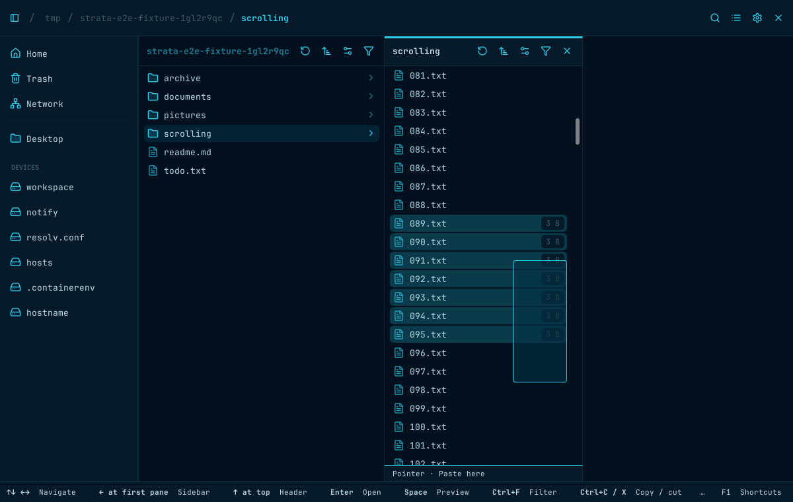
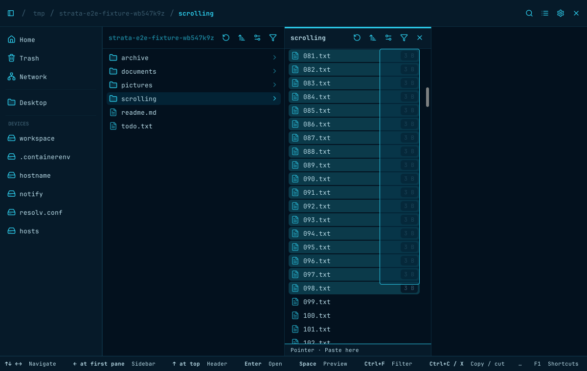
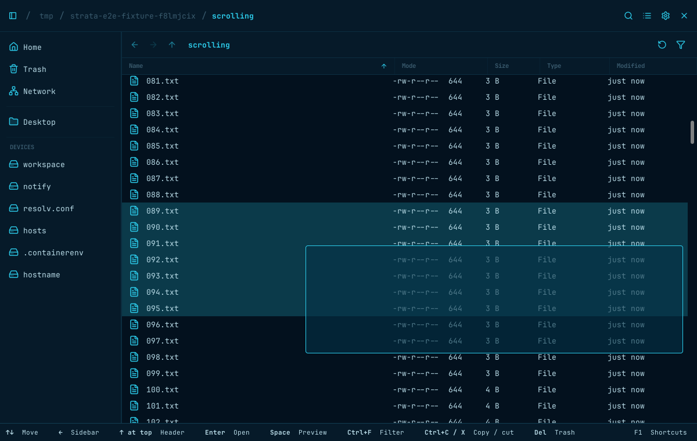
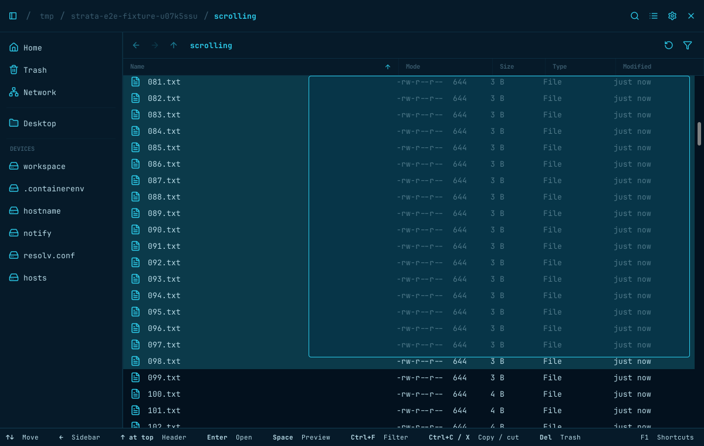
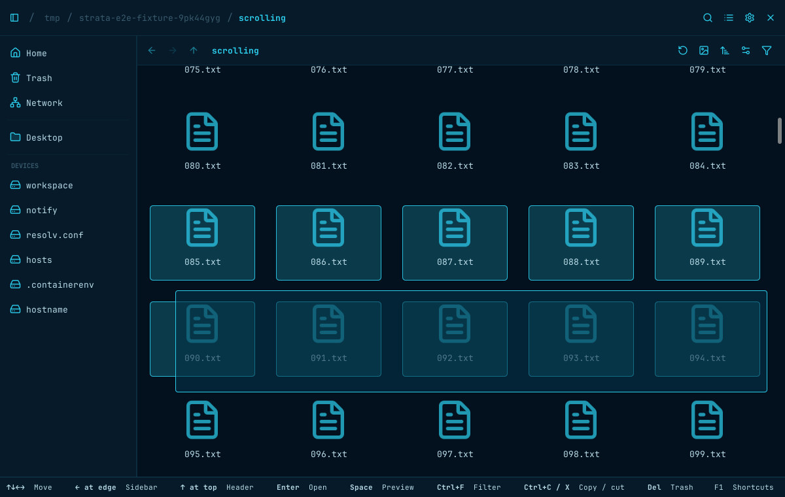
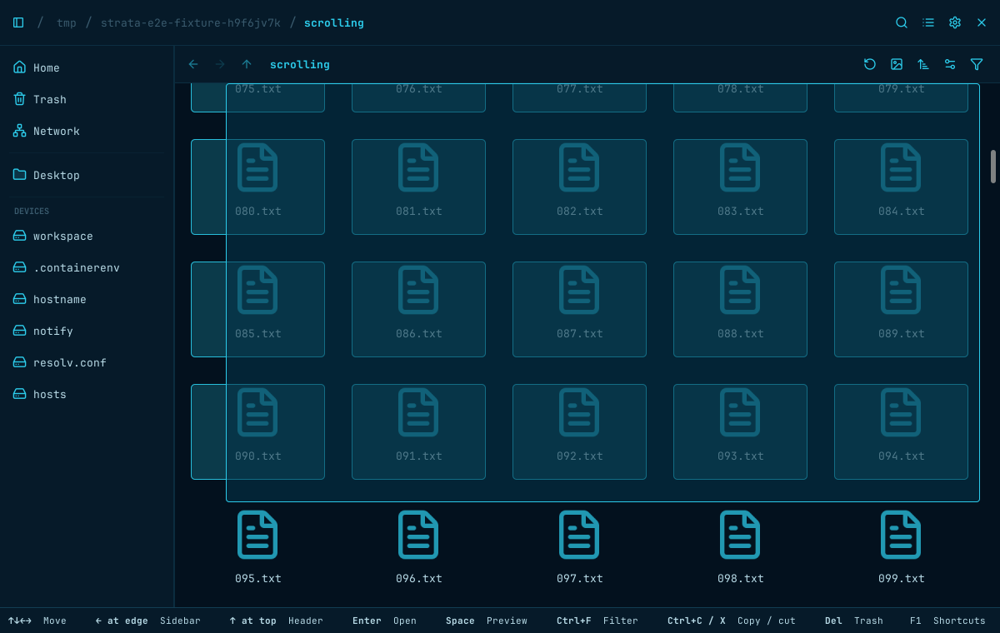

# Pointer drag intent (#517)

Captured on the private Xvfb display in the pinned GTK 4.14 E2E image.
Before: `96ec5b5`. After: `d27a7ad`. Images are cropped to the application window.

Each view shows a directory containing 100 text files, with single-click previews
enabled. The pointer is held after dragging from inert space beside `003.txt`
toward `010.txt`: trailing filename allocation in Columns/List, or the gutter
inside an Icons card beside its thumbnail.

Before, this starts an item drag; Columns also opens a preview prematurely.
After, it draws a marquee and selects the intersected entries without preview.
Dragging from the actual icon/name remains an item drag in every view.

| View | Before | After |
| --- | --- | --- |
| Columns (Grid) |  |  |
| List |  |  |
| Icons |  |  |

## Empty-background click follow-up

On the updated build, a completed plain click on empty space clears file
selections. This also works in List and Icons, in an empty column, and beside the
last column. Holding the press or extending a marquee preserves drag selection.

| Before the click | After the click |
| --- | --- |
|  |  |

## Scrolling follow-up

Before: `2c4b157`. The synthetic directory contains 600 numbered text files.
Hold a marquee beginning beside `010.txt`, then scroll down with the wheel without
moving or releasing the pointer. Before, the band stays at its original viewport
position and newly revealed rows are missed. After, the anchor stays in content
coordinates and selection extends through the scrolled viewport. Edge scrolling
uses the same refresh path; earlier hits remain selected after returning to the top.

| View | Before | After |
| --- | --- | --- |
| Columns (Grid) |  |  |
| List |  |  |
| Icons |  |  |
